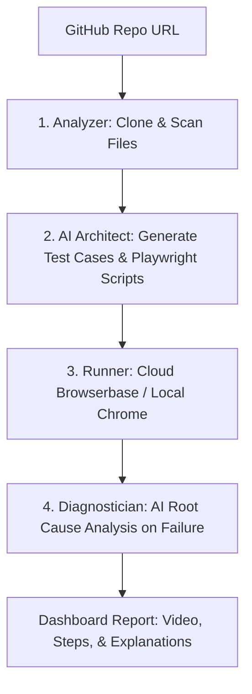

# Technical Architecture & Capabilities Report: AI Testing Automation Agent

This document outlines the technical stack of the **ai-testing-automation-agent** repository and details the capabilities of the system.

---

## 1. Technical Stack

The application is built as a Next.js fullstack application integrated with modern database, ORM, browser automation, and LLM platforms.

### Core Frameworks & Runtime
- **Next.js 16.2.10 (with Turbopack)**: Runs as the central web application framework. It provides both the React frontend and serverless API endpoints (under `src/app/api`).
- **React 19.2.4 & React DOM**: Handles the user interface layer.
- **TypeScript 5**: Formulates type-safe backend and frontend operations.

### Data Layer
- **Neon Database (`@neondatabase/serverless`)**: A serverless PostgreSQL database platform.
- **Drizzle ORM 0.44.4 & Drizzle Kit**: Handles migrations, schema definition, type-safe SQL queries, and database updates.

### AI & LLM Integrations
- **OpenAI API / Nvidia NIM (NVIDIA API)**: Integrated via custom backend handlers (`src/lib/ai-testing.ts` and `src/lib/ai-error-explainer.ts`) to:
  - Generate test cases based on repository file tree analyses.
  - Formulate executable Playwright web test steps.
  - Explain execution failures via browser logs and screenshots.

### Browser Automation & Cloud Testing
- **Playwright Core 1.61.1**: The framework used to drive the browser automation logic.
- **Browserbase Cloud Platform**: A developer-focused headless browser service. When credentials are provided, tests run in Browserbase sessions in the cloud (enabling session recording, live debugging, and cloud logs). When credentials are absent, it falls back to a headless Chromium instance running locally.

---

## 2. Platform Capabilities

The system functions as a fully automated agent that scans repositories, designs tests, runs them in browsers, and diagnoses failures.

### 1. Repository Analysis (`src/lib/github.ts`)
- **Git Clone & Metadata Retrieval**: Clones public/private repositories using GitHub authentication.
- **File System Tree Scanning**: Recursively scans the tree structure (excluding large paths like `node_modules` or `.next`) to detect configuration files (`package.json`, `tsconfig.json`, `next.config.js`).
- **Tech Stack Profiling**: Detects framework signatures (such as React, Next.js, Express) from `package.json` dependencies.
- **File Selection & Snippet Previewing**: Picks critical files (e.g. landing pages, routes) and extracts content snippets to feed to the AI model.

### 2. Automated Test Generation (`src/lib/ai-testing.ts`)
- **Deterministic & AI Generation**: 
  - If API keys are missing, the system uses a deterministic fallback builder that designs basic route tests.
  - If keys are present, it prompts OpenAI to analyze route layout patterns and identify business-critical flows (like form fills, navigations, checks) and generates target test definitions.
- **Script Synthesis**: Converts generated test descriptions into structured JSON-based steps (e.g., `goto`, `click`, `fill`, `expectVisible`) that translate cleanly into Playwright code.

### 3. Test Execution (`src/lib/browserbase.ts`)
- **Hybrid Runner (Cloud / Local)**: Executing a test drives Chromium headlessly.
- **Playwright Script Interpreter**: Dynamically iterates over synthetic steps, translating step instructions (like `fill(selector, value)`) into direct browser actions.
- **Media & Log Capture**: 
  - Records WebM videos of session runs.
  - Captures full browser console logs.
  - Saves full-page screenshots of failures.
  - Generates Browserbase interactive session URLs for cloud replays.

### 4. Intelligent Root Cause Analysis (`src/lib/ai-error-explainer.ts`)
- **AI-Powered Diagnostics**: Upon test failure, the system feeds the screenshot, failing step details, and browser logs into OpenAI.
- **Error Visualization**: The backend draws a **red box highlight** around the failing coordinate coordinates in the screenshot before displaying it to the user.
- **RCA Explanations**: Produces a structured reason and list of potential causes, assigning a confidence score to each root cause, which is displayed in the dashboard.
